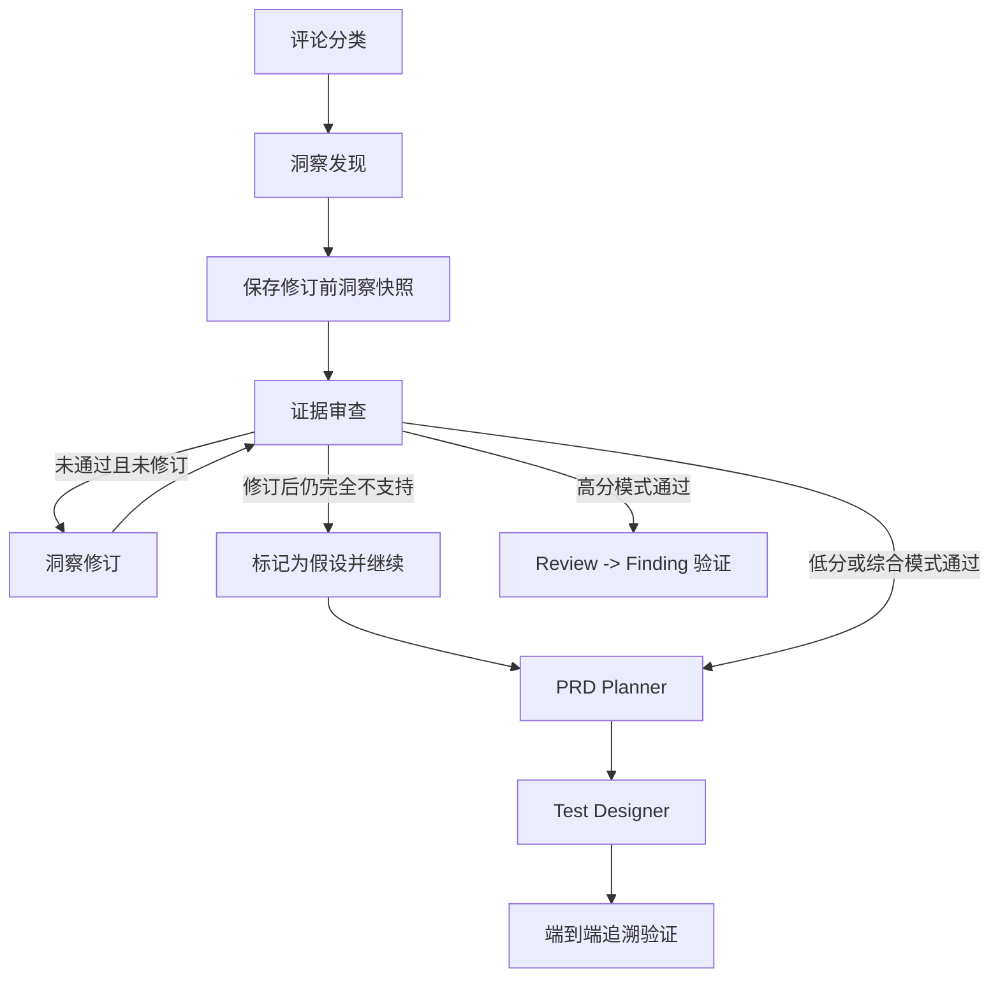

# App Review Insights

App Review Insights 是一个面向 App Store 评论的证据驱动分析系统。系统从 Apple 公开 RSS 获取真实评论，执行确定性清洗，再通过基于 LangGraph 的多 Agent 工作流生成评论分类、产品洞察、PRD 和测试用例。

分析结果不会用样例数据或旧结果静默补齐。证据充分的洞察必须关联真实评论 ID；修订后仍完全不受支持的结论会明确标记为假设，并将该状态传递到后续需求和测试，不会伪装成已验证事实。

## 环境要求

- Node.js 18 或更高版本
- Python 3.11 或更高版本
- 可访问的 OpenAI-compatible 模型及 API Key
- 可访问 Apple RSS 和所配置模型服务的网络环境

## 快速启动

### 1. 创建 Python 虚拟环境

Windows PowerShell：

```powershell
python -m venv .venv
.venv\Scripts\Activate.ps1
python -m pip install -r agent_service\requirements.txt
```

macOS / Linux：

```bash
python3 -m venv .venv
source .venv/bin/activate
python -m pip install -r agent_service/requirements.txt
```

### 2. 配置模型

修改根目录的 `.env.example`


```dotenv
AGENT_SERVICE_URL=http://127.0.0.1:8770

OPENAI_API_KEY=your_api_key_here
OPENAI_BASE_URL=https://api.deepseek.com
OPENAI_MODEL=deepseek-v4-flash
OPENAI_TEMPERATURE=0.2

AGENT_RUN_TIMEOUT_SECONDS=900
AGENT_LLM_TIMEOUT_SECONDS=180
```

变量名描述的是 OpenAI-compatible 协议，不限定具体供应商。使用其他兼容服务时，替换 `OPENAI_BASE_URL` 和 `OPENAI_MODEL` 即可。不支持高级推理参数的模型应将 `OPENAI_REASONING_EFFORT` 和 `OPENAI_THINKING_TYPE` 留空。

完整模型配置：

| 环境变量 | 默认值或示例 | 说明 |
| --- | --- | --- |
| `AGENT_SERVICE_URL` | `http://127.0.0.1:8770` | Node 代理访问 Python sidecar 的地址 |
| `OPENAI_API_KEY` | 无 | 必填，模型服务 API Key |
| `OPENAI_BASE_URL` | 提供方默认地址 | OpenAI-compatible API 根地址 |
| `OPENAI_MODEL` | `gpt-4o-mini` | 模型名称；`.env.example` 使用 `deepseek-v4-flash` |
| `OPENAI_TEMPERATURE` | `0.2` | 较低温度用于提高结构化分析稳定性 |
| `OPENAI_REASONING_EFFORT` | 空 | 可选，仅在模型支持时设置 |
| `OPENAI_THINKING_TYPE` | 空 | 可选，非空且未禁用时发送提供方 thinking 参数 |
| `AGENT_RUN_TIMEOUT_SECONDS` | `900` | 单次 LangGraph 运行总超时 |
| `AGENT_LLM_TIMEOUT_SECONDS` | `180` | 单次模型请求超时 |

### 3. 启动 Python Agent 服务

```bash
uvicorn agent_service.main:app --host 127.0.0.1 --port 8770
```

健康检查：

```text
GET http://127.0.0.1:8770/health
```

正常响应：

```json
{"status":"ok"}
```

### 4. 启动 Node 主服务

在另一个终端执行：

```bash
node serve.js
```

浏览器访问：

```text
http://127.0.0.1:8765/
```


## 核心能力

- 从美国区或中国区 App Store 公开 RSS 采集真实评论。
- 前端提供 50、100、200 三档采集数量，默认 50；后端最多接受 500 条，支持自动分页、重试和部分成功返回。
- 支持导入有字段记录的 JSON/CSV 评论数据，不要求用户填写 App ID。
- 对文本、评分、日期、评论 ID 和重复内容进行确定性清洗。
- 根据自然语言分析目标自动选择高分、低分或综合分析模式。
- 使用 LangGraph 编排评论分类、洞察发现、证据审查、PRD、测试设计和追溯验证 Agent。
- 通过 SSE 实时展示阶段开始、模型等待进度、产物、验证、修订、重试和错误事件。
- 洞察页分开展示证据审查前的原始洞察和审查/修订后的最终洞察，并列出支持与冲突评论 ID。
- 保证 `Review -> Finding -> Requirement -> TestCase` 的可追溯关系。
- Agent 执行失败时保留已完成产物，不回退到模拟结果。


### 多 Agent 流程



各 Agent 的职责：

| Agent | 职责 | 主要产物 |
| --- | --- | --- |
| Classification Agent | 为每条评论标注情感、主题、严重程度和判断依据 | `classifications` |
| Insight Agent | 按分析目标优先排序完整评论样本，生成支持证据、冲突证据和原始洞察快照 | `findingsBeforeRevision`、`findings` |
| Evidence Critic | 检查证据 ID、支持数量、过度泛化和内容冲突，为每条洞察给出处置决策 | `validations`、审查决策 |
| Insight Revision Agent | 只修订 Critic 标记的冲突或证据边界问题，最多一轮 | 修订后的 `findings`、`revisions` |
| PRD Planner | 将已验证、已修订或明确为假设的洞察转换为可验收需求 | `requirements` |
| Test Designer | 为需求生成可追溯测试用例 | `tests` |
| Traceability Validator | 验证产物之间的引用链 | 追溯验证记录 |

## 技术栈

- 前端：HTML、CSS、原生 JavaScript
- 主服务：Node.js 原生 HTTP、Fetch、Web Crypto，无 npm 运行时依赖
- Agent 服务：Python、FastAPI、Uvicorn
- 编排：LangGraph
- 模型接入：LangChain OpenAI-compatible
- 数据校验：Pydantic
- 测试：`node:test`、Pytest

## 模型与提供方

模型通过 `langchain-openai` 的 `ChatOpenAI` 接入，使用 OpenAI-compatible 请求协议。当前示例配置使用 DeepSeek，但业务代码不绑定具体模型提供方。

| 项目 | 当前配置或行为 |
| --- | --- |
| 示例提供方 | DeepSeek |
| 示例 API 地址 | `https://api.deepseek.com` |
| 示例模型 | `deepseek-v4-flash` |
| 接入协议 | OpenAI-compatible Chat Completions |
| LangChain 适配器 | `langchain_openai.ChatOpenAI` |
| 默认温度 | `0.2` |
| 未设置 `OPENAI_MODEL` 时的代码默认值 | `gpt-4o-mini` |
| 结构化输出 | 模型返回 JSON，随后由 Pydantic 校验 |

可替换为任何与 OpenAI 请求格式兼容的提供方。切换模型时不需要修改 Agent 图，只需更新 `.env` 中的 API 地址、模型名称和 API Key。若缺少 API Key，服务会返回 `MODEL_CONFIG_MISSING`，不会启动伪造或本地模拟分析。

## 使用流程

1. 选择输入方式：填写合法的 App Store 详情页链接，或导入 JSON/CSV 评论文件。
2. 使用 App Store 链接时选择美国区或中国区，并选择 50、100、200 条目标数量；默认 50。
3. 输入分析目标，例如“关注低分评论、订阅阻碍和易用性缺陷”。
4. 点击“开始分析”。
5. 在执行监控区域查看实时事件、验证、修订和错误。
6. 在产物工作区查看原始评论、清洗数据、分类、洞察、PRD 和测试用例。

## 分析目标与产物

分析目标不仅会作为提示词传递给模型，还会被后端确定性地解析为工作流模式。前端也会同步调整排序、阶段状态和可见产物。

| 模式 | 目标示例 | 主要证据 | 分类展示 | 最终产物 |
| --- | --- | --- | --- | --- |
| 高分模式 `positive` | `关注高分评论和产品优点` | 全部评论，4-5 分优先 | 高分优先，评分从高到低 | 分类、产品优点洞察、`Review -> Finding` 验证 |
| 低分模式 `negative` | `关注低分评论和用户痛点` | 全部评论，1-3 分优先 | 低分优先 | 分类、问题洞察、PRD、测试用例、完整追溯验证 |
| 综合模式 `balanced` | `同时关注高分优点和低分问题` | 全部评论 | 评分从高到低 | 分类、综合洞察、PRD、测试用例、完整追溯验证 |

高分模式在证据审查通过后结束，不生成 PRD 和测试用例；对应标签页会隐藏，“需求与测试”阶段显示为“不适用”。若目标同时包含明显的正向和负向意图，系统进入综合模式。


## 评论采集与清洗

### 数据来源

服务端从经过校验的 `https://apps.apple.com` 链接提取数字 App ID，再请求 Apple 公开 RSS JSON：

```text
https://itunes.apple.com/{country}/rss/customerreviews/page={page}/id={appId}/sortby=mostrecent/json
```

采集规则：

- 当前支持美国区 `us` 和中国区 `cn`。
- 每页通常最多约 50 条，最多请求 10 页、返回 500 条。
- 页面串行请求，页间隔 150 ms。
- 单页请求超时 10 秒；超时、HTTP 429 和 5xx 最多重试 2 次。
- 后续页面失败时保留已采集评论并返回 warning；第一页失败时整个采集请求失败。
- 空页会被记录并继续尝试后续页面；检测到重复页时提前停止。
- 每次采集都请求 Apple 实时 RSS，不读取或回退到本地历史缓存；实时源为空时返回 0 条并明确说明数据限制。

### 清洗规则

清洗顺序固定，因此相同输入会产生稳定结果：

1. 字段转换为字符串并去除首尾空白。
2. 使用 Unicode NFKC 标准化，保留 emoji、中文和其他语言。
3. 统一换行、不可见空格和连续空白。
4. 删除不在 1-5 范围内的整数评分。
5. 删除正文为空的评论，允许标题为空。
6. 日期转换为 ISO 8601，无法解析时保留为 `null`。
7. 缺少来源 ID 时，根据 App ID、作者、日期、标题和正文生成稳定 SHA-256 ID。
8. 先按来源 ID 去重，再按标题、正文、评分和版本指纹去重。
9. 保留相似但不完全相同的评论，避免误删真实证据。

每条保留评论包含 `cleanStatus`、`fingerprint` 和 `normalizationVersion`，接口同时返回完整清洗报告。

## API

浏览器只调用 Node 同源 API。Node 将分析请求代理到 Python sidecar，避免前端跨域并保护模型配置。

### 采集评论

```http
POST /api/reviews/collect
Content-Type: application/json
```

```json
{
  "appUrl": "https://apps.apple.com/us/app/example/id839285684",
  "country": "us",
  "maxReviews": 50
}
```

响应包含 `appId`、`storefront`、统一格式的 `reviews` 和采集元数据 `collection`。

### 清洗评论

```http
POST /api/reviews/clean
Content-Type: application/json
```

```json
{
  "appId": "839285684",
  "reviews": []
}
```

响应包含清洗后的 `reviews` 和 `report`。单次最多清洗 500 条。

### 导入 JSON / CSV 评论

```http
POST /api/reviews/import
Content-Type: application/json
```

请求体中的 `content` 是浏览器读取的文件文本，服务端不会保存上传文件：

```json
{
  "fileName": "reviews.csv",
  "content": "id,rating,title,text\nr1,5,Great,Very useful"
}
```

支持以下 JSON 结构：直接评论数组，或 `{ "reviews": [] }`、`{ "data": [] }`、`{ "records": [] }`。CSV 使用第一行作为表头，支持 `id`、`rating`、`title`、`text/content`、`author`、`createdAt/date`、`version` 等常见字段名及中文别名。用户无需提供 App ID；服务端会根据文件内容生成稳定的内部数据集 ID，仅用于清洗和追溯。单个文件最多 500 条、2 MB。导入后仍必须经过现有确定性清洗，再进入多 Agent 分析。

### 运行多 Agent 分析

```http
POST /api/analysis/run
Content-Type: application/json
Accept: text/event-stream
```

```json
{
  "appId": "839285684",
  "goal": "关注低分评论、订阅阻碍和易用性缺陷",
  "reviews": [],
  "collection": {},
  "cleanReport": {}
}
```

接口返回 SSE 事件流。事件类型包括：

- `stage_started`：阶段开始
- `stage_completed`：阶段完成
- `progress`：模型请求开始及每约 15 秒一次的等待心跳
- `artifact`：产生或更新分析产物
- `validation`：证据或追溯验证结果
- `revision`：洞察修订记录
- `retry`：模型请求或解析重试
- `error`：任务终止错误
- `completed`：返回最终产物

最终事件中的 `data` 包含：

```json
{
  "analysisMode": "negative",
  "classifications": [],
  "insights": [],
  "insightsBeforeRevision": [],
  "insightsAfterRevision": [],
  "requirements": [],
  "tests": [],
  "validations": [],
  "revisions": [],
  "rejectedFindings": [],
  "dataLimitations": []
}
```

`insightsBeforeRevision` 是 Insight Agent 首次输出的只读快照，不会被 Evidence Critic 回写；`insightsAfterRevision` 和兼容字段 `insights` 是证据审查及最多一轮修订后的最终版本，PRD、测试和追溯校验只消费最终版本。`rejectedFindings` 为兼容旧客户端和审计保留，当前“完全不支持则降级为假设”的策略下通常为空。

### 错误格式

普通 API 错误和 SSE `error` 事件均使用结构化错误信息：

```json
{
  "error": {
    "code": "AGENT_RUN_FAILED",
    "message": "洞察阶段执行失败。",
    "stage": "洞察发现",
    "retryable": true
  }
}
```

## 证据与追溯规则

- 每条分类必须引用输入中的真实 `review.id`，并完整覆盖输入评论。
- 初次生成的每条洞察必须包含真实 `evidenceIds`；修订后仍完全不受支持的洞察允许 `evidenceIds: []`，但必须标记为 `hypothesis`。
- `supportCount` 必须等于 `evidenceIds.length`。
- 支持评论放入 `evidenceIds`；与结论相反的评论放入 `conflictEvidenceIds`，冲突 ID 不计入 `supportCount`。
- Evidence Critic 会检查不存在的评论 ID、无证据结论、支持数错误、过度泛化和文本冲突。
- 首轮审查失败只允许修订一次；修订后仍完全不支持时，系统移除无效引用、将支持数修正为 0、标记为假设并继续下游，不伪造证据，也不删除结论。
- 每条需求必须引用 `sourceFindingId`。
- 每条测试必须引用 `requirementId` 和 `sourceFindingId`。
- 假设或修订状态会沿洞察、需求和测试链路保留。
- 最终追溯验证会区分“完整证据链通过”和“引用关系通过但包含无证据假设”；真实引用断链时任务仍返回错误。

## 减少幻觉与不支持结论

系统使用多层约束降低模型生成无依据结论的概率：

1. **真实数据边界**：模型只能接收采集并清洗后的真实评论；网络失败时不会用开发样例替代。
2. **证据 ID 强制引用**：支持与冲突证据 ID 都必须来自输入评论；完全不支持的假设使用空证据数组，不允许生成不存在的 ID。
3. **确定性计数检查**：代码验证 `supportCount === evidenceIds.length`，不依赖模型自我声明。
4. **分类覆盖检查**：分类 ID 集合必须与输入评论 ID 集合完全一致，缺失、重复或额外 ID 都会使阶段失败。
5. **结构化 schema**：所有 Agent 输出先解析为 JSON，再通过 Pydantic 类型和字段约束；无效输出最多修复一次，仍无效则停止。
6. **双层 Evidence Critic**：先执行确定性证据检查，再由模型检查语义是否过度泛化、与原评论矛盾或证据不足，并补充冲突评论 ID。
7. **双版本洞察**：保留修订前只读快照和审查后的最终版本，便于比较结论、证据和假设状态变化。
8. **受控修订**：审查失败只允许修订一轮，且只接受 Critic 标记为需要修订的洞察改动。
9. **完全不支持降级**：修订后仍完全不支持的结论不删除、不伪装成通过，而是清除无效引用并标记为 `hypothesis`，继续生成带假设状态的 PRD 和测试。
10. **下游状态传播**：需求继承源洞察状态，测试继承需求和源洞察状态；前端在洞察卡片显示“假设”和原因。
11. **端到端追溯**：最终代码校验 `Review -> Finding -> Requirement -> TestCase` 引用链；无 Review 支持的假设会得到“含无证据假设”的单独验证记录。
12. **低随机性**：示例温度设置为 `0.2`，减少同一输入下的格式和判断漂移。
13. **失败显式化**：模型配置、请求、解析或真实追溯断链都会产生结构化错误，不把空结果包装成成功。

这些措施不能证明模型的产品判断一定正确，但可以确保已验证结论来源可追溯，无证据内容只能以明确假设进入最终产物，并为人工复核保留修订前后上下文。

## 故障处理

故障处理按输入、数据源、模型、图编排和前端五层执行：

| 层级 | 故障场景 | 处理策略 | 对外结果 |
| --- | --- | --- | --- |
| 输入层 | 非 Apple 域名、缺失 App ID、非法 storefront、空评论、超过 500 条 | 在进入采集或图执行前校验并拒绝 | `INVALID_APP_URL`、`INVALID_AGENT_INPUT` 等结构化错误 |
| Apple 数据层 | 超时、429、5xx、无效 JSON、空页、后续页失败 | 单页最多重试 2 次；支持空页继续和后续页部分成功，不使用历史缓存 | `warnings` 或明确失败；不生成评论 |
| 模型层 | Key 缺失、网络错误、超时、429、5xx | 单次调用受 `AGENT_LLM_TIMEOUT_SECONDS` 强制限制；等待期间每约 15 秒发送进度；请求错误最多重试 2 次并指数退避 | `MODEL_CONFIG_MISSING` 或 `MODEL_REQUEST_FAILED` |
| 输出层 | 空输出、Markdown 包裹、JSON 解析失败、Pydantic schema 不通过 | 追加“只返回 schema JSON”的修复请求，最多重试 1 次 | `MODEL_OUTPUT_INVALID`，当前 Agent run 停止 |
| Agent 节点层 | 分类覆盖不全、证据不存在、支持数错误、节点异常 | 分类或节点异常会终止；证据问题进入一次修订，修订后仍完全不支持则清理无效引用并降级为假设 | SSE 验证/修订事件；真实节点异常返回 `error` |
| 图编排层 | Evidence Critic 不通过、修订后仍不支持、追溯断链、总超时 | 最多修订 1 轮；完全不支持的洞察以假设继续；真实引用断链或总超时才终止 | 假设继续下游，或返回 `TRACEABILITY_VALIDATION_FAILED`、`AGENT_RUN_TIMEOUT` |
| Node 代理层 | Python sidecar 不可用、SSE 中断 | 代理返回 502 或流中发送错误事件；浏览器显示停止状态 | `AGENT_SERVICE_UNAVAILABLE` 或 `AGENT_STREAM_INTERRUPTED` |
| 前端层 | 采集/清洗/Agent 任一阶段失败 | 停止后续阶段，保留已完成真实产物和错误记录 | 显示“部分成功/已停止/需重试”，不回退样例数据 |

补充约束：客户端断开后，Python 流程停止继续消费后续事件；高分模式在证据验证后有意跳过 PRD 和测试节点，而不是故障跳过。

## 项目结构

```text
app-review-insights/
|
|-- README.md                  # 项目说明、架构、启动方式和技术设计
|-- .env.example               # Node 代理和 Python Agent 的模型配置
|-- .gitignore                 # 环境变量、虚拟环境和测试产物忽略规则
|
|-- index.html                 # 分析控制台页面
|-- styles.css                 # 页面布局和视觉样式
|-- app.js                     # 前端状态、阶段流程、API 和 SSE 事件处理
|-- sample-reviews.js          # 开发样例数据，不参与真实分析或故障回退
|-- serve.js                   # Node 静态服务、评论 API 和 Agent SSE 代理
|
|-- lib/                       # Node 数据处理模块
|   |-- apple-reviews.js       # Apple RSS 实时采集、分页、重试和字段映射
|   |-- review-cleaner.js      # Unicode 标准化、校验、稳定 ID、指纹和去重
|   `-- review-importer.js     # JSON/CSV 评论导入与字段适配
|
|-- data/
|   `-- import-fixtures/       # 可提交的 JSON/CSV 导入测试数据
|
|-- test/                      # Node.js 单元测试和接口代理测试
|   |-- apple-reviews.test.js  # Apple 链接、分页、重试和实时源策略测试
|   |-- review-cleaner.test.js # 评论清洗、ID 和重复数据测试
|   |-- review-importer.test.js# JSON/CSV 导入测试
|   `-- analysis-proxy.test.js # Node 到 Python SSE 代理测试
|
|-- agent_service/             # Python LangGraph 多 Agent 服务
|   |-- main.py                # FastAPI、健康检查和 SSE 分析接口
|   |-- graph.py               # LangGraph StateGraph 和条件路由
|   |-- state.py               # 多 Agent 全链路状态定义
|   |-- schemas.py             # Review、Finding、Requirement 等 Pydantic schema
|   |-- analysis_mode.py       # 高分、低分和综合模式识别与证据排序
|   |-- llm.py                 # 模型配置、调用、JSON 解析和重试策略
|   |-- errors.py              # 统一 Agent 错误协议
|   |-- requirements.txt       # Python 依赖
|   |-- README.md              # Python sidecar 的独立启动说明
|   |
|   |-- agents/                # LangGraph 节点实现
|   |   |-- classification.py  # 评论分类 Agent
|   |   |-- insight.py         # 洞察发现和洞察修订 Agent
|   |   |-- critic.py          # Evidence Critic 和确定性证据检查
|   |   |-- prd.py             # PRD 需求规划 Agent
|   |   |-- test_designer.py   # QA 测试用例 Agent
|   |   |-- traceability.py    # Review 到最终产物的追溯验证
|   |   `-- common.py          # Prompt 数据裁剪、JSON 序列化和事件发送
|   |
|   `-- tests/                 # Python 单元测试
|       |-- test_analysis_mode.py # 分析目标模式和评分排序测试
|       |-- test_data_limitations.py # 数据量限制和采集限制说明测试
|       |-- test_llm_config.py    # 模型配置和超时识别测试
|       |-- test_traceability.py  # 证据、状态和追溯链测试
|       `-- conftest.py           # Pytest 测试配置
```


## 测试

运行 Node 测试：

```bash
node --test
```

运行 Python 测试：

```bash
python -m pytest agent_service/tests
```

测试覆盖评论链接和 storefront 校验、RSS 映射、分页、重试、实时源策略、JSON/CSV 导入、确定性清洗、分析模式、模型配置、模型超时、冲突证据、假设降级和追溯断链检测。

## 安全与数据边界

- App Store URL 必须使用 HTTPS 且域名严格为 `apps.apple.com`。
- Apple RSS 地址由服务端根据数字 App ID 和受支持 storefront 构造，不直接请求用户提供的任意 URL。
- 模型 API Key 只从后端环境变量读取。
- `.env`、虚拟环境和测试缓存均已加入 `.gitignore`。
- 系统不会在网络或模型失败时生成伪造评论，也不会把 `sample-reviews.js` 当作真实结果。

## 当前边界

- 支持在线 Apple RSS 以及有字段记录的 JSON/CSV 文件导入；尚未实现自定义远程数据源连接器。
- 仅支持美国区和中国区 App Store。
- Apple RSS 是公开但未承诺稳定版本的接口，其可用性、历史深度、分页和响应结构可能变化。
- 单次采集、清洗和 Agent 分析最多处理 500 条评论。
- 分析模式通过明确的中英文关键词确定；表达含糊时会进入综合模式。
- 分析产物仅保留在当前页面状态中，未实现持久化历史和导出。
- 模型分析质量取决于所选模型、评论样本和分析目标；证据校验能够约束引用关系，但不能替代人工产品判断。
